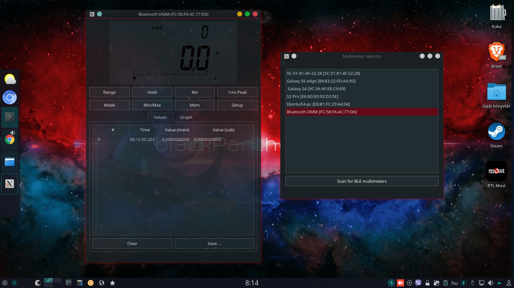

# Aneng AN9002 Bluetooth DMM 

The 9002 is a BLE enabled multimeter (Forked from 121gw-qt5), NOT released, only for tests.

### Contributors are welcome!

* This project will hopefully evolve into a full-fledged application at some point, but it's not right now.

## Developer info and help

Wiki: https://github.com/blackPantherOS/AN9002/wiki

## Status

* Under development! Not working now.

## Prerequisites

* Qt >= 5.11 (due to some recent additions to the QtBluetooth stack)

## Build

`qmake`

`make`

## License

* GPLv2

# Screenshot

